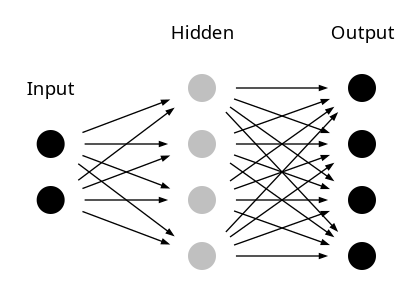
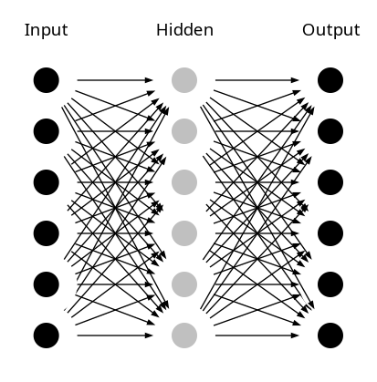

# NeuralNetwork
This project demonstrates a simple feedforward neural network trained using backpropagation. Two examples are provided:  
- `bits.py`: Converts binary input to its corresponding decimal representation.  
- `successive.py`: Predicts the next number in a sequence.  


## bits.py

> This neural network takes 2 bits as input and gives the output converted in decimal.
>
> For example:
> ```
> input (0b10): [1, 0]
> output (2): [0, 0, 1, 0]
> ```


#### Neural Network Architecture:
| Input Neurons | Hidden Layer 1 | Output Neurons |
|-------------|----------------|--------------|
| 2 | 4 |  4 |




## successive.py
> This neural network takes a number as input and returns the successive number as output.
> For example, with four numbers:
> ```
> input (number 2): [0, 1, 0, 0]
> output (number 3): [0, 0, 1, 0]
> ```

#### Neural Network Architecture:
| Input Neurons | Hidden Layer 1 | Output Neurons |
|-------------|----------------|--------------|
| 6 | 6 | 6 |




